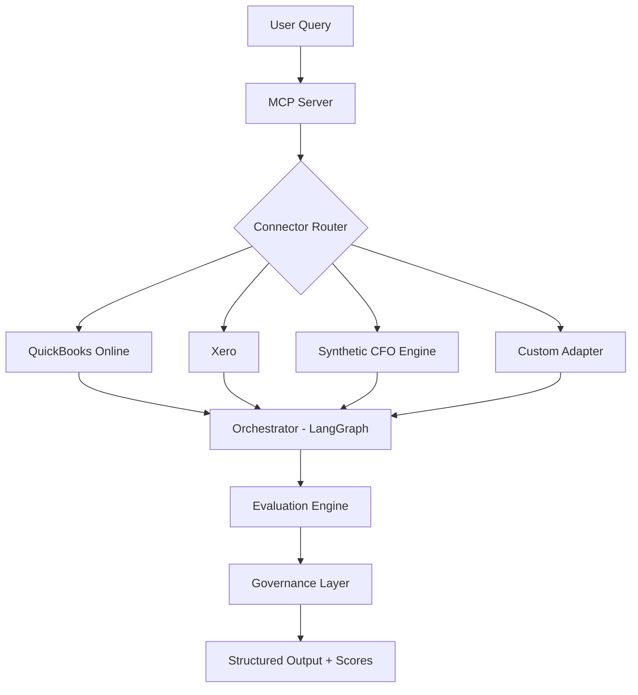

# Stratifi

> Trusted, auditable AI intelligence for CFOs — multi-agent financial analysis with built-in evaluation and governance.

## Quick Start

Run these commands in your terminal:

```bash
# Clone the repository
git clone https://github.com/your-org/stratifi.git
cd stratifi

# Install dependencies
pip install -r requirements.txt

# Run the zero-config demo
python scripts/run_demo.py
```

Output includes structured AI response + evaluation scores saved to `demo_output/`.

---

## 🏗️ Architecture



## 📦 Core Components

| Module | Purpose |
|--------|---------|
| `stratifi/mcp/` | MCP-compliant server with pluggable finance connectors |
| `stratifi/orchestrator/` | LangGraph state machine for agent coordination |
| `stratifi/evaluation/` | CFO-specific rubric (accuracy, actionability, risk, clarity) |
| `stratifi/governance/` | Audit trails, consent management, payload envelopes |
| `scripts/run_demo.py` | Zero-config end-to-end demo runner |

## 🔌 Supported Data Sources

| Source | Status | Config |
|--------|--------|--------|
| Synthetic CFO Engine | ✅ Default | `CONNECTOR=synthetic` |
| QuickBooks Online | 🟡 Ready | `CONNECTOR=quickbooks` + sandbox creds |
| Xero | 🔜 Coming | `CONNECTOR=xero` |
| Qlik / Looker / PowerBI | 🔌 Pluggable | Custom MCP adapter |

## 📊 Evaluation Rubric

Stratifi scores outputs on 5 CFO-critical dimensions:

| Dimension | Weight | Description |
|-----------|--------|-------------|
| **Financial Accuracy** | 30% | Traceable figures, correct calculations |
| **Actionability** | 25% | Clear owners, timelines, success metrics |
| **Risk Awareness** | 20% | Quantified risks + mitigations |
| **Stakeholder Clarity** | 15% | Executive/board-ready communication |
| **Data Faithfulness** | 10% | Zero hallucinations, explicit assumptions |

**Quality gates:** PoC ≥ 3.0 · Production ≥ 4.0

## 🛠️ Development

```bash
# Set up virtual environment
python -m venv .venv
source .venv/bin/activate

# Install with dev dependencies
pip install -r requirements-dev.txt

# Run linter
ruff check .

# Run tests
pytest tests/ -v

# Run the demo with a specific connector
CONNECTOR=synthetic python scripts/run_demo.py
```

## 📜 License

MIT. See LICENSE for details.

## 🤝 Contributing

1. Fork the repo
2. Create your feature branch (`git checkout -b feat/amazing-connector`)
3. Commit your changes (`git commit -m 'feat: add new connector'`)
4. Push to the branch (`git push origin feat/amazing-connector`)
5. Open a Pull Request

---

Built for CFOs who demand trusted, actionable, and auditable AI.
